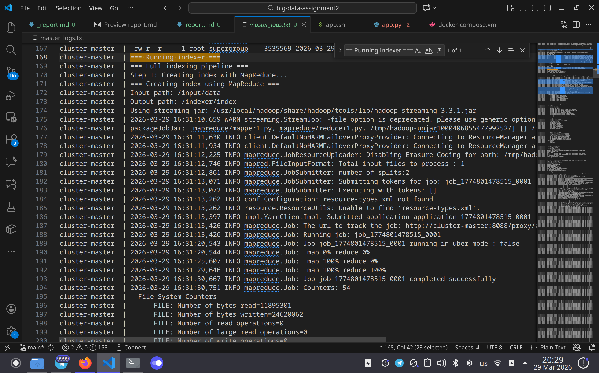
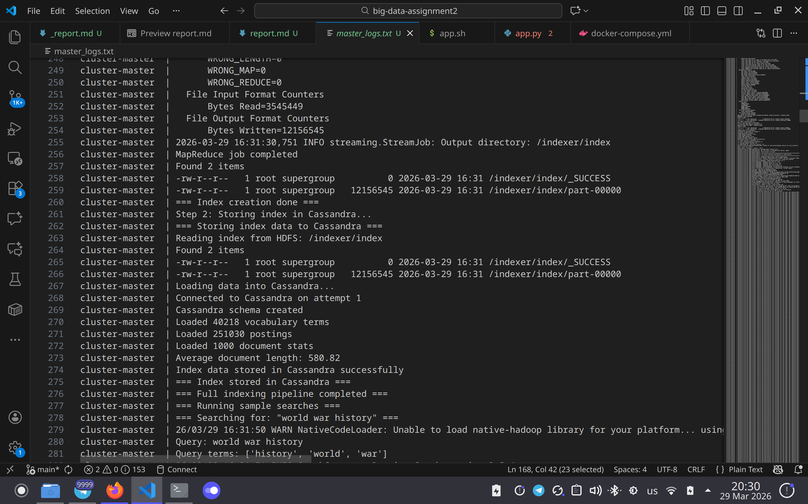
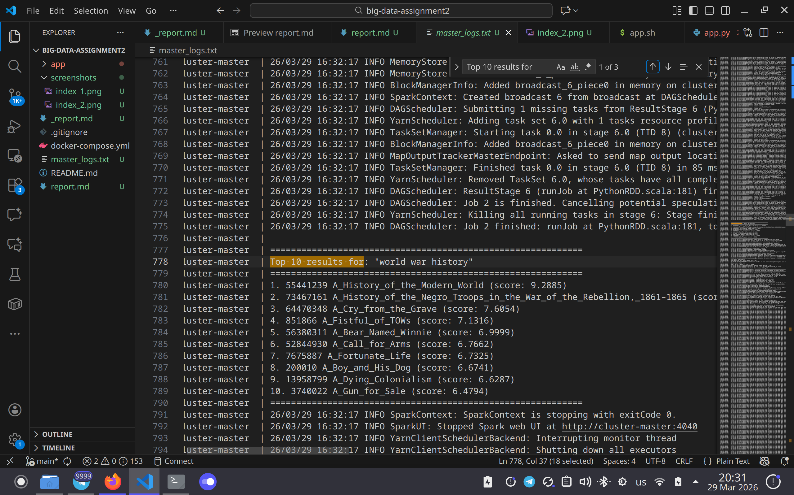
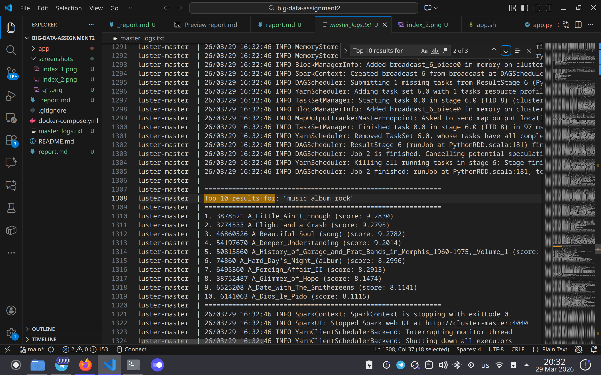
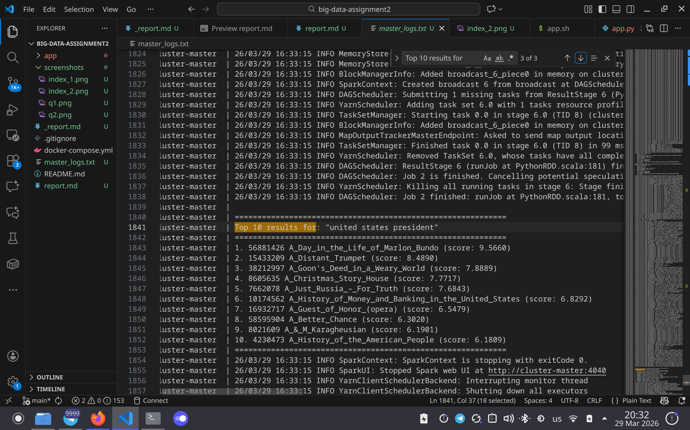

# Assignment report

by Kirill Shumskii

## Methodology

### 1. Data preparation

Since given data preparation script didn't work because of lack of RAM on my machine, I needed to implement some modifications. I modified `create_doc` function to upload .txt documents in hdfs storage, also I decreased batch size to 32. In addition I've added document text cleaning.

### 2. Indexing

This pipeline satisfies minimal functional requirements for implementing inverted index and was first natural choice for full-text search engine. I have decided to index 1000 docs to test performance on larger slice

#### Map

For each input line (`doc_id`, `title`, `text`):

1. Tokenizes text with regex `[a-z0-9]+`.
2. Computes document length (`doc_len = number of tokens`).
3. Computes term frequency (`tf`) per term in the document.
4. Emits records:

```
term\tdoc_id\ttf\tdoc_len\ttitle
```


#### Reduce

For each grouped term:

1. Collects all postings for that term.
2. Computes document frequency `df = len(postings)`.
3. Emits one record per posting with attached `df`:
```
term\tdf\tdoc_id\ttf\tdoc_len\ttitle
```

### 3. Storage design

I have designed 4 tables in cassandra:

- `vocabulary(term -> df)` for fast term metadata lookup.
- `postings((term), doc_id -> tf)` for fast retrieval of all docs containing a term.
- `doc_stats(doc_id -> title, doc_len)` for document metadata and normalization factors.
- `global_stats(id -> total_docs, avg_doc_len)` for collection-level ranking constants.

Since I have precomputed statistics for docs and terms, such denormalization avoids heavy joins and follows query driven design. This design allows efficiently compute all needed terms for BM25 full text search.

### 4. Querying and ranking

I have designed standard BM25 query pipeline that:

1. Tokenizes query terms using the same regex as indexing
2. Reads all needed info from cassandra (global, postings, docs meta)
3. Computes BM25 per posting in Spark RDD then sums by `doc_id`
4. Sorts results by score

BM25 params: `K1 = 1.2 B = 0.75`


## Demonstration

### How to run guide

1. Run `docker compose up -d` from the root of the project. 
2. Master node will execute `app.sh` automatically. This script runs all of the steps of the assignment.
3. Queries results could be found in `cluster-master` logs, since they are printed in stdout (marked as `Top 10 results for: "query text ..."`)
4. You could run `docker compose logs -f cluster-master > master_logs.txt` for more convenient display.


### Reflection

Pipeline successfully worked on distributed system and gave meaningful results for my searches. Execution time for all stages (preparation, indexing, querying) is moderate and expected considering data volume and available hardware.

Examples of queries:

```
============================================================
Top 10 results for: "world war history"
============================================================
1. 55441239 A_History_of_the_Modern_World (score: 9.2885)
2. 73467161 A_History_of_the_Negro_Troops_in_the_War_of_the_Rebellion,_1861–1865 (score: 7.6598)
3. 64470348 A_Cry_from_the_Grave (score: 7.6054)
4. 851866 A_Fistful_of_TOWs (score: 7.1316)
5. 56380311 A_Bear_Named_Winnie (score: 6.9999)
6. 52844930 A_Call_for_Arms (score: 6.7662)
7. 7675887 A_Fortunate_Life (score: 6.7325)
8. 200010 A_Boy_and_His_Dog (score: 6.6741)
9. 13958799 A_Dying_Colonialism (score: 6.6287)
10. 3740022 A_Gun_for_Sale (score: 6.4794)
============================================================
```

```
============================================================
Top 10 results for: "music album rock"
============================================================
1. 3878521 A_Little_Ain't_Enough (score: 9.2830)
2. 3274533 A_Flight_and_a_Crash (score: 9.2795)
3. 46860526 A_Beautiful_Soul_(song) (score: 9.2782)
4. 54197670 A_Deeper_Understanding (score: 9.2014)
5. 50813860 A_History_of_Garage_and_Frat_Bands_in_Memphis_1960–1975,_Volume_1 (score: 8.4405)
6. 74860 A_Hard_Day's_Night_(album) (score: 8.2996)
7. 6495360 A_Foreign_Affair_II (score: 8.2913)
8. 38752487 A_Glimmer_of_Hope (score: 8.1474)
9. 6525208 A_Date_with_The_Smithereens (score: 8.1141)
10. 6141063 A_Dios_le_Pido (score: 8.1115)
============================================================
```


```
============================================================
Top 10 results for: "united states president"
============================================================
1. 56881426 A_Day_in_the_Life_of_Marlon_Bundo (score: 9.5660)
2. 15433209 A_Distant_Trumpet (score: 8.4890)
3. 38212997 A_Goon's_Deed_in_a_Weary_World (score: 7.8889)
4. 8605635 A_Christmas_Story_House (score: 7.7717)
5. 7662078 A_Just_Russia_–_For_Truth (score: 7.6843)
6. 10174562 A_History_of_Money_and_Banking_in_the_United_States (score: 6.8292)
7. 16932717 A_Guest_of_Honor_(opera) (score: 6.5479)
8. 58595904 A_Better_Chance (score: 6.3020)
9. 8021609 A_&_M_Karagheusian (score: 6.1901)
10. 4230473 A_History_of_the_American_People (score: 6.1809)
============================================================
```

## Screenshots

### Indexing 1000 docs





### Queries

#### Q1


#### Q2


#### Q3



